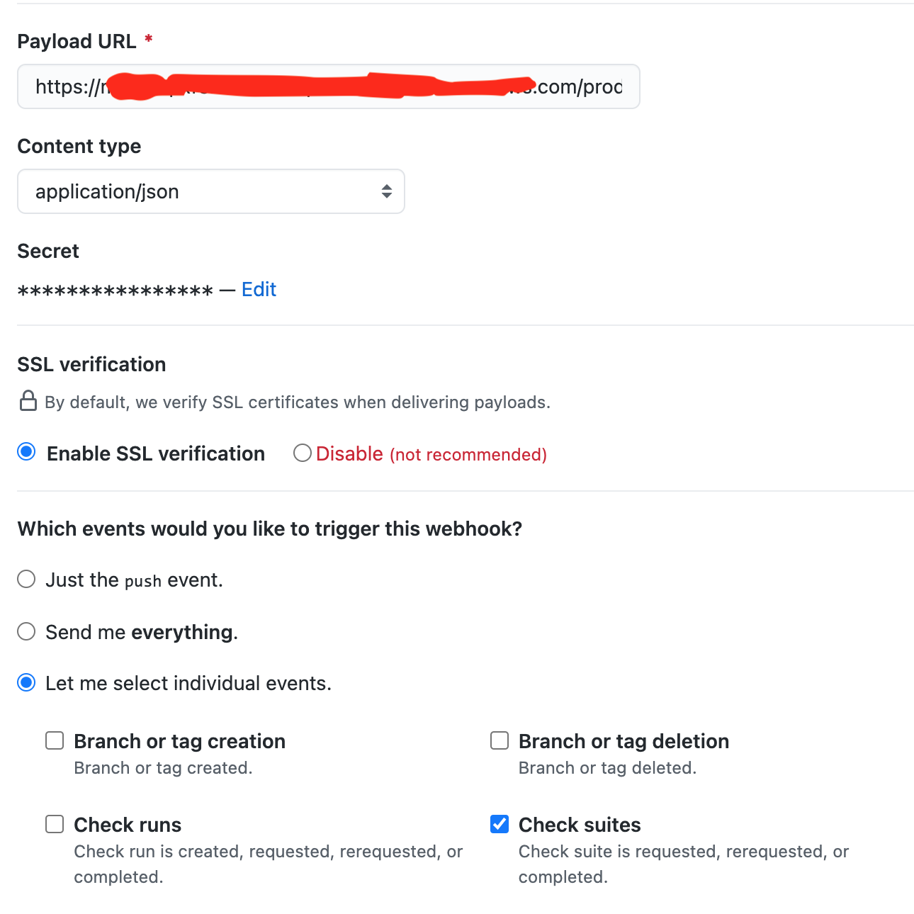

# All Checks Passed GitHub API Gateway Webhook

## What is this project about

If you have required checks in GitHub for merging and If you insist on branches to be up to date before merging, and if some checks run based on what has changed in the PR, this project might be something for you.

It is currently (March 2021) not possible to set all the important checks that you want to pass before merging a PR if those checks do not run all the time, there is no way you can merge that PR unless you are an admin on GitHub.

Imagine you have a GitHub Action that is triggered whenever some path in the repo changes. If you set this check as required and there is a PR that does not invoke this workflow, the PR cannot be merged.

This project aims to fix this by checking if all checks that were invoked, pass. If they all pass, this project creates a `success` status. If any of the checks fail, this project sets `failure` status.

## Why not use GitHub Actions(GHA) to achieve this project

`check_run` and `check_suite` events in GHA come with some restrictions. Firstly, they are only run on the `master` branch and not on PRs. Secondly, [a GHA cannot be triggered when another GHA finishes to prevent recusrive behavior](https://docs.github.com/en/actions/reference/events-that-trigger-workflows#check_suite).

## How do I deploy this project?

This project comes with a [companion terraform module](./terraform_module/). This module can be used to deploy this project or you could use this as a reference to deploy it however you want to.

## How do I integrate it with GitHub

Integration is pretty straight forward like any other webhook. Grab the webhook url and the shared secret and setup the webhook as specified in the [documentation](https://docs.github.com/en/developers/webhooks-and-events/creating-webhooks). Just send `check_suite` events and nothing else.

